# バックエンドの構成

バックエンドは 1 つの Go のバイナリで、認証（auth）とチャット（chat）を同じプロセスで動かす。
このページは全体の形をつかむための入口で、細かい決まりは各 ADR に書いてある。

## パッケージの分け方

| パッケージ | 役割 |
|---|---|
| `internal/auth` | 登録・ログイン、Access Token の発行、Refresh Token のローテーションと再利用の検知 |
| `internal/chat` | ワークスペース・ロール・招待・ルーム・メッセージ・添付と、リアルタイム配信（`chat/realtime`） |
| `internal/chat/authz` | 「読めるか・書けるか・管理できるか」の判定。DB に触らない純粋な関数だけを置く |
| `internal/platform` | 横断的なもの。`authn`（JWT の検証、ws-ticket）、`storage`（S3 API）、DB・Redis・設定・ログ・ID・Clock |
| `internal/httpx` | ルーティング、ミドルウェア、JSON の形、ドメインのエラーから HTTP への変換、WebSocket の読み書き |

- **auth と chat は同じバイナリにいるが、chat は auth を import しない。** 境界を守っておけば、あとで別のプロセスに切り出すときもルーティングの変更で済む（[ADR 0001](../adr/0001-auth-in-same-binary.md)）。
- **2 つの接点は決まっている。** 1 つは `internal/platform/authn` が JWT を検証して渡す userID / sid / email の検証の状態、もう 1 つは Redis の `auth:revoked` に流れる失効イベント。
- **JWT の検証は公開鍵（JWKS）でローカルに完結させる。** chat から auth へ同期的に問い合わせない。
- **email を検証していない利用者は、chat の入り口で止める。** 判定は authn のミドルウェア（`RequireVerifiedEmail`）の 1 か所だけで、chat のコードは検証のことを知らない（[ADR 0053](../adr/0053-require-verified-email.md)）。
- 同じバイナリを横に並べれば台数を増やせる。インスタンスの間の配信は Redis Pub/Sub を通す（[ADR 0016](../adr/0016-redis-pubsub-delivery.md)）。

## 認証とトークン

- **認証はトークンを発行する。Cookie は Web クライアントの実装の詳細にすぎない。** 将来のネイティブアプリでも同じ API を使えるようにするため。
- REST は `Authorization` ヘッダの Access Token（JWT、15 分）で認証する。JWT にロールや権限は入れない（失効できないので、ロールは DB を正とする）。
- Refresh Token は Web なら httpOnly Cookie、それ以外は JSON の本文で受け渡す。この分岐は `internal/httpx` の 1 ファイルに閉じ込めてあり、auth は生のトークン文字列だけを扱う（[ADR 0010](../adr/0010-auth-api-details.md)）。
- Refresh Token はローテーションし、使い回しを検知したらそのセッション（family）ごと失効させる。DB にはハッシュだけを保存する。

### ws-ticket と失効

- WebSocket の URL に Access Token を載せない代わりに、**30 秒だけ有効な ws-ticket** を REST で発行し、接続のときに 1 回だけ消費する。
- ws-ticket の発行と消費は `internal/platform/authn` に置く。chat が auth の Redis キーを直接読まないようにするため（[ADR 0007](../adr/0007-session-revocation-and-ws-ticket.md)）。
- ログアウトや Refresh Token の再利用の検知で失効したセッションは、`auth:revoked` を受けた各インスタンスが WebSocket を即座に切る。
  REST は Access Token の期限まで通る（最大 15 分の遅れを許容する）。取りこぼしに備えて、5 分ごとに接続を再検証する。

## リクエストの流れ

REST のリクエストは、次の順に層を通る。

1. **httpx**: ルーティング（`net/http` の `ServeMux`）、ミドルウェア（アクセスログ、認証、email の検証）、JSON の読み取りと検証
2. **ドメイン（`internal/chat` / `internal/auth`）**: ユースケースの本体。判定に要る事実（ロール、ルームのメンバーか）を DB から読み、authz に渡す
3. **authz**: 事実から「できるか」だけを返す。認可の判断はここにしか書かない（CLAUDE.md ルール 9。[ADR 0011](../adr/0011-chat-workspace-room-api.md)）
4. **sqlc**: SQL は `db/queries/` に自分で書き、sqlc が Go のコードを生成する。ORM は使わない（[ADR 0003](../adr/0003-sqlc-over-orm.md)）

- **ID は ULID をアプリで作り、DB には `uuid` 型で保存する**（[ADR 0005](../adr/0005-ulid-stored-as-uuid.md)）。
- 並行して起きうる操作（seq の採番、冪等な送信、ロールの変更）は、行ロックの順序を決めて直列にする。詳しくは [データモデル](data-model.md)。
- エンドポイントごとの入力と出力は REST API リファレンス（サイドバーの REST API）にある。Go の型とエンドポイントの表から生成している（[ADR 0064](../adr/0064-documentation-site.md)）。

## エラーの形

- **ドメインは HTTP のステータスを知らない。** `ErrNotFound`・`ErrForbidden`・`ErrConflict` のような sentinel error や型付きのエラーを返す。
- **HTTP への変換は `internal/httpx` だけで行う。** 形は RFC 9457 の `application/problem+json`。クライアントは `type` の値で分岐し、`title` は表示に使わない。
- **読めないものは 404 にする。** ワークスペースのメンバーでない、private ルームを読めない、といった場合に 403 を返すと、ID を知っているだけの人に存在が分かるため。読めるが操作できない場合は 403（[ADR 0011](../adr/0011-chat-workspace-room-api.md)）。
- 認証の失敗では、ユーザーがいるかどうかが応答の中身にも時間にも出ないようにする。

## リアルタイム配信

メッセージは REST で送り、Postgres にコミットした時点で確定する。WebSocket は確定したものを速く届けるための経路にすぎない（[ADR 0004](../adr/0004-hybrid-delivery-ws-and-rest.md)）。

- **`Delivery` インターフェース**: ユースケースはコミットの後にイベントを `Delivery` に渡すだけで、WebSocket も接続も知らない。宛先（ルーム・ワークスペース・ユーザー）を接続に解決するのは実装の側。将来の Push 通知も、配信先の 1 つとして同じインターフェースの裏に加わる（[ADR 0015](../adr/0015-websocket-hub-and-delivery.md)）。
- **Redis Pub/Sub**: いまの実装は、イベントを `room:` / `workspace:` / `user:` のチャンネルに publish する。各インスタンスは、自分の接続が要るチャンネルだけを購読して Hub に渡す（[ADR 0016](../adr/0016-redis-pubsub-delivery.md)）。
- **Hub**: 自分のインスタンスの接続だけを管理し、購読に合わせて配る。1 つの接続に書き込む goroutine は 1 本だけにする。送信キューが一杯になった遅いクライアントは、待たずに切る。
- **配信は落ちうる前提にする。** Redis Pub/Sub は at-most-once で、publish の失敗やインスタンスの停止でイベントは失われる。
  クライアントはルームごとに変更番号（`change_seq`）のカーソルを持ち、再接続したときや番号の欠けを見つけたときに、REST の `after_change_seq` で差分を取る（[ADR 0014](../adr/0014-message-change-seq.md)）。
  `after_seq`（新しいメッセージだけ）は履歴を読むのに使い、編集と削除も拾える `after_change_seq` を同期に使う。
- **権限の変更はすぐに効かせる。** キック・ロールの変更・非公開ルームから外すと、Hub はイベントを送る前にそのユーザーの購読を DB で検証し直し、読めなくなったものを外す。接続したときの認可の結果をキャッシュし続けない（[ADR 0006](../adr/0006-workspaces-roles-invites.md)、[ADR 0015](../adr/0015-websocket-hub-and-delivery.md)）。

イベントの種類とデータの形、close コード、再接続の手順は [WebSocket イベント](../events.md) にある。

## presence と typing

- **自動で変わるもの（オンラインか、入力中か）は Redis に TTL 付きで置き、Postgres に書かない。** 数秒ごとに変わる値を永続化する意味がなく、プロセスが落ちても TTL で自然に消えるため。
  - presence は、ユーザーの接続を持つインスタンスごとにハッシュのフィールドを置き、フィールドごとに TTL を付ける（[ADR 0016](../adr/0016-redis-pubsub-delivery.md)）。
  - typing は短い TTL のキーで間引き、止まったことは通知せず、受け取った側が一定時間で消す（[ADR 0015](../adr/0015-websocket-hub-and-delivery.md)）。
- **本人が選んだ設定（手動の離席、カスタムステータス）は Postgres に持つ。** 消えると困るため。
  画面に出す状態（オンライン・離席・オフライン）は、読む側がこの 2 つを合わせて決める（[ADR 0049](../adr/0049-away-and-custom-status.md)）。

## ファイル

- **ファイルの中身は Go のサーバーを通さない。** クライアントは署名付き URL でストレージに直接 PUT / GET する。
- サーバーが行うのは、authz、URL の発行、アップロード後の HEAD による検証だけ。サイズと Content-Type は署名に含めるので、申告と違う PUT はストレージが拒む（[ADR 0013](../adr/0013-attachment-api.md)）。
- ストレージへのアクセスは `internal/platform/storage` の S3 API の抽象を通す。ローカルは MinIO、本番は Cloudflare R2 で、特定のベンダーの SDK に依存しない（[ADR 0008](../adr/0008-object-storage-s3-api.md)）。
