# データモデル

データの正本は PostgreSQL。図は `docs/erd.mermaid` から生成している。
このページは、表の関係と「順序・同期・未読をどの番号で決めるか」をつかむための入口。

## 階層

- **`workspaces` → `rooms` → `messages` の 3 段。** Slack / Discord の「ワークスペース → チャンネル」と同じ形。
- **コードでは `room` と呼び、画面の表示だけ「チャンネル」にする。** Redis Pub/Sub のチャンネルや Go の channel と紛らわしいため（[ADR 0006](../adr/0006-workspaces-roles-invites.md)）。
- 所属は `workspace_members`、ルームへの参加は `room_members` で表す。抜けたら行を削除する（在籍の履歴は持たない）。

### ルームの種類（`rooms.kind`）

| kind | 読める人 | 書ける人 |
|---|---|---|
| `public` | ワークスペースのメンバー全員（参加していなくても読める） | 参加した人 |
| `private` | ルームのメンバーだけ。参加する前の履歴も読める | ルームのメンバー |
| `dm` | 2 人だけ | 2 人だけ |

- **DM はワークスペースの中に閉じる。** 同じ 2 人の DM は、2 人の ID から作る `dm_key` の UNIQUE 制約で 1 つに限る。メンバーは追加できない。
- `is_default` のルームには、招待を受け入れたときに自動で参加する。

### メッセージの種類（`messages.kind`）

- `user` は人の発言、`system` は参加・退出・名前の変更などのログ。
- **システムメッセージも 1 行のメッセージとして seq を採番する。** 同じ一覧と同じ同期の仕組みに乗せるため。文言はクライアントが `system_type` と `system_data` から作る（[ADR 0033](../adr/0033-system-messages.md)）。
- スレッドの返信は `thread_root_id` で親を指す。チャンネルのタイムラインには出さない（[ADR 0036](../adr/0036-threads.md)）。

## ロール

- **ワークスペース単位の固定ロール `owner > admin > member` だけを持つ。** ルーム単位のロールとカスタムロールは持たない。
- 判定は 2 つの関数で表す（[ADR 0006](../adr/0006-workspaces-roles-invites.md)）。
  - `canManage(actor, target)`: actor のロールが target より上
  - `canGrant(actor, role)`: 付与するロールが actor 以下で、かつ owner ではない
  - ロールの変更は、この 2 つの両方を満たすときだけできる
- **owner は常に 1 人。** 昇格ではなく「譲渡」という別の操作で移す。`role = 'owner'` の部分 UNIQUE 制約で DB が保証する。
- ロールの変更・キック・譲渡は、関係する `workspace_members` の行をロックしてから、ロックの後に読んだロールで判定する（[ADR 0011](../adr/0011-chat-workspace-room-api.md)）。

## 招待

- 招待はワークスペース単位のリンク（`workspace_invites`）で、使用回数の上限と期限を持てる。
- **コードの生の値は DB に保存しない。** SHA-256 のハッシュだけを持ち、生のコードは作成したときに 1 度だけ返す。DB が漏れてもリンクとして使えないようにするため。
- 使用回数は条件付きの UPDATE で加算し、並行した受け入れでも上限を超えない。
- 作成できるのは admin 以上。`invite_policy = all_members` のときだけ member も作成できる。

## 順序と同期: seq と change_seq

ルームの中の出来事は、ルームごとに採番する番号で並べる。**`created_at` は表示だけに使い、並べるのにもカーソルにも使わない。** 複数のインスタンスの時計はずれ、同じ時刻に 2 件できることもあるので、時刻では順序もカーソルも曖昧になるため（[ADR 0002](../adr/0002-message-ordering-by-seq.md)）。

| 番号 | 何が進めるか | 使いみち |
|---|---|---|
| `seq` | メッセージの作成 | 順序の唯一の根拠。履歴のページング（`before_seq` / `after_seq`） |
| `change_seq` | 作成・編集・削除 | 同期のカーソル。再接続の差分取得（`after_change_seq`）と、イベントの取りこぼしの検出 |

- **どちらもルームの中で 1 から欠番なく増える。** 送信と同じトランザクションの中で、`rooms` の行のカウンタ（`last_message_seq` / `last_change_seq`）を 1 文で進めて採番する。ロールバックすれば採番も戻る。
- **2 つを 1 つの番号にまとめない。** 編集や削除で seq が進むと、未読数の引き算が壊れるため（[ADR 0014](../adr/0014-message-change-seq.md)）。
- スレッドの返信もルームの seq / change_seq を共有する。そのため、チャンネルだけを見ると seq は飛び飛びになる。取りこぼしは change_seq で見つけるので、クライアントは seq の連続性に頼らない（[ADR 0036](../adr/0036-threads.md)）。
- 同期の手順そのものは [WebSocket イベント](../events.md) の「同期」にある。

## 未読

未読数は、数え直さずに引き算 1 回（O(1)）で求める。

- **チャンネルの未読 = `rooms.last_user_seq - room_members.last_read_user_seq`。**
  `user_seq` は、チャンネルに出る人の発言だけを数えた番号（[ADR 0033](../adr/0033-system-messages.md)）。
  - システムメッセージは seq を消費するが `user_seq` は進めないので、「誰かが参加した」だけで未読は増えない。
  - スレッドの返信も進めない。「チャンネルにも投稿する」を付けた返信だけはチャンネルの発言として数える（[ADR 0039](../adr/0039-thread-broadcast.md)）。
- **スレッドの未読 = 親の `last_thread_seq - thread_members.last_read_thread_seq`。** `thread_seq` はスレッドの中の返信の番号。
  スレッドに参加するのは、親の投稿者と返信した人（[ADR 0036](../adr/0036-threads.md)）。
- **自分が送ったら、自分の既読位置も進める。** 自分の発言で自分に未読を作らない。
- 削除したメッセージも数に含まれる。O(1) で求めるために受け入れた近似。

## 冪等な送信

- 送信には、クライアントが作る ULID の `client_msg_id` を必須にする。
- **`UNIQUE(room_id, sender_id, client_msg_id)` で、同じ送信を 2 回受けても 1 件にする。** 重複した送信には、既存のメッセージを 200 で返す。
  通信が切れて応答を受け取れなかったクライアントが、同じ ID で安心して送り直せるようにするため（[ADR 0004](../adr/0004-hybrid-delivery-ws-and-rest.md)）。
- 再送で seq を無駄に消費しないよう、送信者の `room_members` の行をロックしてから既存を探し、なければ採番する（[ADR 0012](../adr/0012-message-api.md)）。

## スキーマの決まりごと

- **ID は ULID をアプリで作り、`uuid` 型で保存する。** API では ULID の文字列で返す。DB の既定値（`gen_random_uuid()` など）には頼らない（[ADR 0005](../adr/0005-ulid-stored-as-uuid.md)）。
- **列挙値は Postgres の enum 型ではなく、`text` と `CHECK` 制約にする。** 値を変えるマイグレーションが楽なため。
- 時刻はすべて `timestamptz`。外部キーには `ON DELETE` の挙動を必ず書く。
- **ページングはカーソルにし、`OFFSET` を使わない。** メッセージは seq、メンバーや招待の一覧は ID をカーソルにする。`limit` には上限がある（[ADR 0011](../adr/0011-chat-workspace-room-api.md)）。
- **生の秘密を保存しない。** Refresh Token・招待コード・ワンタイムトークンは、ハッシュだけを持つ。
- 自動で変わる presence / typing はこの図にない。Redis に TTL 付きで置いている（[バックエンドの構成](backend.md)）。
- マイグレーションは goose で、1 テーブル 1 ファイルではなくドメインの単位でまとめる。

## 対象外

ブロック、グループ DM、ルーム単位のロール、カスタムロールは作らない。
